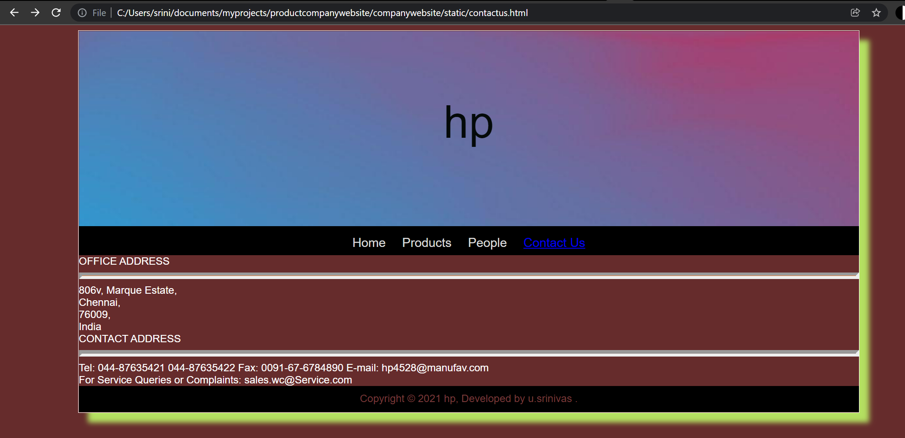
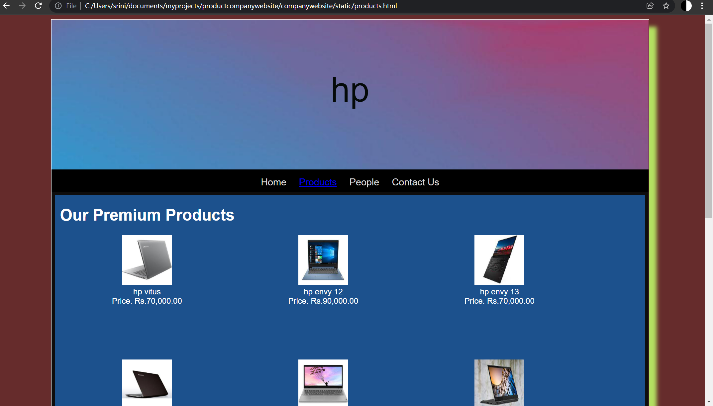
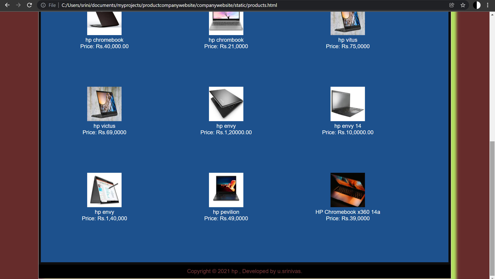
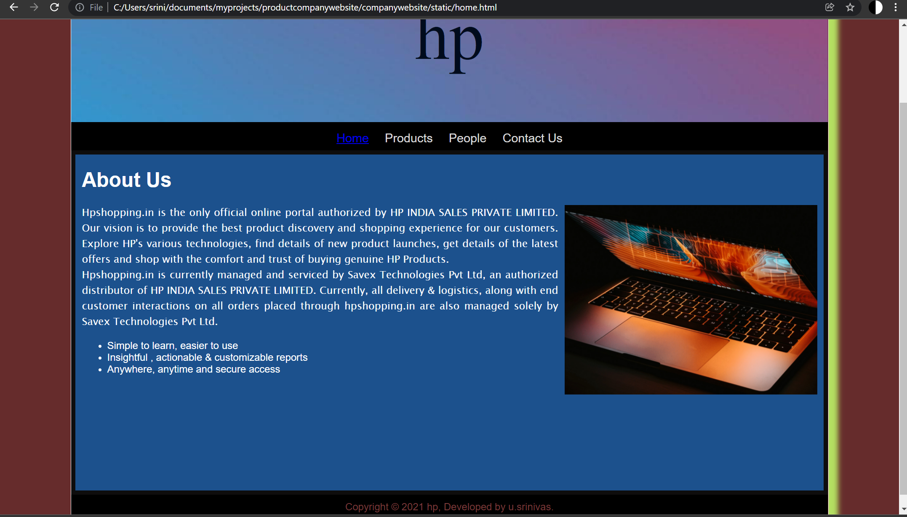
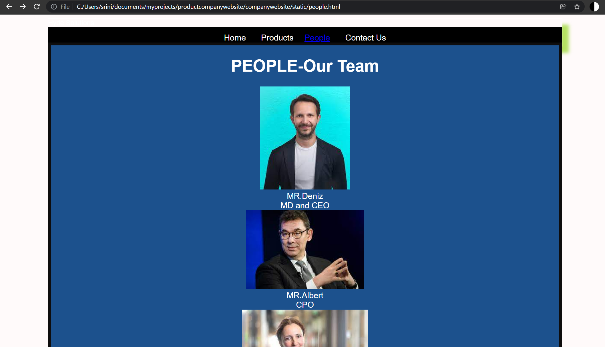

# Web Design for a Software Product Company

## AIM:

To design a static website for a software product company company.

## DESIGN STEPS:

### Step 1:

Requirement collection.

### Step 2:

Creating the layout using HTML and CSS.

### Step 3:

Updating the sample content.

### Step 4:

Choose the appropriate style and color scheme.

### Step 5:

Validate the layout in various browsers.

### Step 6:

Validate the HTML code.

### Step 6:

Publish the website in the given URL.

## PROGRAM :
home page
~~~
<!DOCTYPE html>
<html lang="en">
  <head>
    <title>HP</title>
    <link rel="stylesheet" href="./css/layout.css" />
    <link rel="icon" href="./img/icon.png" type="image/x-icon" />
  </head>

  <body>
    

      
hp

      

        
<a href="/static/home.html">Home</a>

        
<a href="/static/products.html">Products</a>

        
<a>People</a>

        
<a>Contact Us</a>

      

      

        

                    <h1>About Us</h1>
          
                    

                      Hpshopping.in is the only official online portal authorized
                       by HP INDIA SALES PRIVATE LIMITED. Our vision is to provide 
                       the best product discovery and shopping experience for our 
                       customers. Explore HP's various technologies, find details 
                       of new product launches, get details of the latest offers 
                       and shop with the comfort and trust of buying genuine HP 
                       Products.
             
            Hpshopping.in is currently managed and serviced by Savex Technologies
            Pvt Ltd, an authorized distributor of HP INDIA SALES PRIVATE LIMITED.
             Currently, all delivery & logistics, along with end customer interactions
              on all orders placed through hpshopping.in are also managed solely by
               Savex Technologies Pvt Ltd.
            <ul>
              <li>Simple to learn, easier to use</li>
              <li>Insightful , actionable & customizable reports</li>
              <li>Anywhere, anytime and secure access</li>
            </ul>
          

        

      

      

        Copyright &#169; 2021 hp, Developed by u.srinivas.
      

    

  </body>
</html>
~~~

### PRODUCT 
~~~
<!DOCTYPE html>
<html lang="en">
  <head>
    <title>EduSoft Private Limited</title>
    <link rel="stylesheet" href="./css/layout.css" />
    <link rel="icon" href="./img/icon.png" type="image/x-icon" />
  </head>

  <body>
    

      
hp

      

        
<a href="/static/home.html">Home</a>

        

          <a href="/static/products.html">Products</a>
        

        
<a>People</a>

        
<a>Contact Us</a>

      

      

        
    
          <h1>Our Premium Products</h1>
          

              
 
                  

                  
                  

                  
hp vitus

                  
Price: Rs.70,000.00 

              

              
 
                  

                  
                  

                  
hp envy 12 

                  
Price: Rs.90,000.00 

              

              
 
                

                
                

                
hp envy 13

                
Price: Rs.70,000.00 

            

            
 
              

              
              

              
hp chromebook

              
Price: Rs.40,000.00 

          

          
 
            

            
            

            
hp chrombook

            
Price: Rs.21,0000 

        

        
 
          

          
          

          
hp vitus

          
Price: Rs.75,0000 

      

      
 
        

        
        

        
hp victus 

        
Price: Rs.69,0000 

    

    
 
      

      
      

      
hp envy

      
Price: Rs.1,20000.00 

  

  
 
    

    
    

    
hp envy 14

    
Price: Rs.10,0000.00 

 
  

  
  

  
hp envy 

  
Price: Rs.1,40,000 

 
  

  
  

  
hp pevilion

  
Price: Rs.49,0000 

 
  

  
  

  
HP Chromebook x360 14a

  
Price: Rs.39,0000 

          

          
        
      

      

        Copyright &#169; 2021 hp , Developed by u.srinivas.
      

    

  </body>
</html>
~~~
### PEOPLE
~~~
<!DOCTYPE html>
<html lang="en">
  <head>
    <title>Hyde Solutions</title>
    <link rel="stylesheet" href="./css/layout.css" />
    <link rel="icon" href="./img/hydeicon.jpeg" type="image/x-icon" />
  </head>

  <body>
    

      
Hyde Solutions

      

        
<a href="/static/home.html">Home</a>

        

        
<a href="/static/products.html">Products</a>

        

            <a href="/static/people.html">People</a>
        

        

        
<a>Contact Us</a>

      

        
 
            <h1>PEOPLE-Our Team</h1>
            

                

                    

                    
                    

                    
MR.Deniz

                    
MD and CEO

                

                
 
                  

                      
 
                          

                          
                          

                          
MR.Albert

                          
CPO

                      

                      
   
                      
                        

                            
 
                                

                                
                                

                                
MS.Filiz

                                
CHRO

                            

                      
                        
  
                                
                                    

                                        
 
                                            

                                            
                                            

                                            
MR.Sylvester

                                            
Joint MD and CTO

                              

                        
 
                                          
                                          

                                              
 
                                                  

                                                  
                                                  

                                                  
MR.William

                                                  
Head,Retail Sales

                               

                               
    
                           
                                

                                    
 
                                        

                                        
                                        

                                        
Ms.Olivia

                                        
CFO

                     

                
          

        

      

      

        Copyright &#169; 2021 Hp., Developed by u.srinivas.
      

     

     </body>
</html>
~~~
### contactus
~~~
<!DOCTYPE html>
<html lang="en">
  <head>
    <title>WeCraft</title>
    <link rel="stylesheet" href="./css/layout.css" />
    <link rel="icon" href="./img/icon.png" type="image/x-icon" />
  </head>

  <body>
    

      
hp

      

        
<a href="/static/home.html">Home</a>

        

          <a href="/static/products.html">Products</a>
        

        
<a href="/static/people.html">People</a>

        
<a href="/static/contactus.html">Contact Us</a>

      

      

          OFFICE ADDRESS  
          

          
          806v, 
          Marque Estate, 
          Chennai, 
          76009, 
          India 

          CONTACT ADDRESS 
          

          
          Tel: 044-87635421
               044-87635422
          Fax: 0091-67-6784890
          E-mail: hp4528@manufav.com
           
           For Service Queries or Complaints: sales.wc@Service.com
        
        

        

            Copyright &#169; 2021 hp, Developed by u.srinivas .
        
                                           
      

      </body>
      </html>
  ~~~
    
## OUTPUT:

### Home Page:

## Result:

Thus a website is designed for the software product company and the HTML,CSS code are validated.
